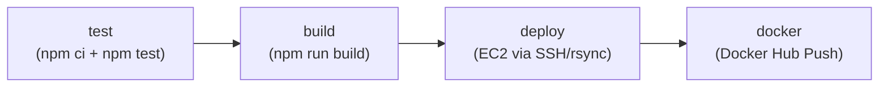

# CR-01 – Workflow `deploy.yml` im Detail erklärt

> Datei: [`.github/workflows/deploy.yml`](../../.github/workflows/deploy.yml)
> Diese Review geht Zeile für Zeile durch die Pipeline und erklärt zu jedem Job **und** jedem Step, *was* er tut, *womit* (welche Action/welcher Befehl) und *warum* er so und nicht anders konfiguriert ist.

## Überblick

Die Pipeline besteht aus vier Jobs, die sequentiell aufeinander aufbauen (`needs:`):



| Job | Läuft auf | Braucht (`needs`) | Bedingung (`if`) | Zweck |
| --- | --- | --- | --- | --- |
| `test` | `ubuntu-latest` | — | immer | Unit-Tests ausführen (Vitest) |
| `build` | `ubuntu-latest` | `test` | immer | Produktions-Build erstellen, als Artefakt ablegen |
| `deploy` | `ubuntu-latest` | `build` | nur Push auf `main` | Build-Artefakt per SSH/rsync auf EC2 veröffentlichen |
| `docker` | `ubuntu-latest` | `deploy` | nur Push auf `main` | Docker-Image bauen und auf Docker Hub pushen |

Wichtig: `test` und `build` laufen **immer** — auch bei Pull Requests. `deploy` und `docker` laufen **nur** bei einem echten Push auf `main`, nie bei PRs (siehe Erklärung weiter unten bei `if:`).

---

## Trigger: `on:`

```yaml
on:
  push:
    branches: [main]
  pull_request:
    branches: [main]
  workflow_dispatch:
```

Der Workflow startet in drei Fällen:

- **`push` auf `main`** — jeder Commit, der direkt oder per Merge auf `main` landet, löst den kompletten Workflow aus (inkl. `deploy` und `docker`, da die `if`-Bedingung dort erfüllt ist).
- **`pull_request` gegen `main`** — jeder PR, der `main` als Zielbranch hat, löst ebenfalls den Workflow aus, aber `deploy` und `docker` überspringen sich selbst wegen ihrer `if`-Bedingung (`github.event_name != 'pull_request'`). Das ist bewusst so gebaut: Ein PR soll zeigen, ob Tests und Build grün sind, **ohne** dass fremder/ungeprüfter Code automatisch auf die Produktions-Instanz deployt oder ein Docker-Image gepusht wird.
- **`workflow_dispatch`** — erlaubt das manuelle Auslösen des Workflows über die GitHub-UI (*Actions → CI/CD auf AWS EC2 → Run workflow*) oder per `gh workflow run deploy.yml`. Praktisch, um z. B. einen Deploy erneut anzustoßen, ohne einen leeren Commit pushen zu müssen.

## Globale Umgebungsvariable: `env`

```yaml
env:
  NODE_VERSION: '24'
```

Eine einzige zentrale Variable für die Node.js-Version, die in `test` und `build` per `${{ env.NODE_VERSION }}` wiederverwendet wird. Vorteil: Die Node-Version muss bei einem Upgrade nur an dieser einen Stelle geändert werden, statt in jedem Job einzeln.

---

## Job `test`

```yaml
test:
  name: Test
  runs-on: ubuntu-latest
  steps:
```

Läuft auf einem frischen, von GitHub bereitgestellten Ubuntu-Runner (jeder Job bekommt eine **eigene, saubere VM** — nichts aus `test` ist in `build` automatisch vorhanden, siehe unten bei Artefakten).

### Step 1 — `actions/checkout@v4`

```yaml
- uses: actions/checkout@v4
```

Checkt den Repository-Inhalt (den Commit/PR-Head, der den Workflow ausgelöst hat) in das Arbeitsverzeichnis des Runners aus. Ohne diesen Step wäre das Runner-Dateisystem leer — kein `package.json`, kein Quellcode, nichts zu testen. Das ist praktisch immer der erste Step in jedem Job, der mit Repo-Inhalten arbeitet.

### Step 2 — `actions/setup-node@v4`

```yaml
- uses: actions/setup-node@v4
  with:
    node-version: ${{ env.NODE_VERSION }}
    cache: npm
```

Installiert Node.js in der über `env.NODE_VERSION` festgelegten Version (`24`) auf dem Runner.

- `cache: npm` aktiviert das eingebaute Dependency-Caching der Action: Sie hasht `package-lock.json`, legt den `npm`-Cache-Ordner unter diesem Hash ab und lädt ihn bei einem folgenden Lauf mit unverändertem Lockfile wieder ein. Das beschleunigt den nächsten `npm ci`-Step spürbar, weil Pakete nicht jedes Mal neu aus der Registry heruntergeladen werden müssen.

### Step 3 — „Abhängigkeiten installieren“

```yaml
- name: Abhängigkeiten installieren
  run: npm ci
```

`npm ci` (statt `npm install`) installiert die Abhängigkeiten **exakt** wie in `package-lock.json` festgeschrieben — reproduzierbar und schneller, da kein Dependency-Resolving stattfindet. Zusätzlich löscht `npm ci` vorher einen eventuell vorhandenen `node_modules`-Ordner komplett. Das ist der Standard für CI-Umgebungen (im Gegensatz zu `npm install`, das primär für die lokale Entwicklung gedacht ist und `package-lock.json` bei Bedarf sogar verändern würde).

### Step 4 — „Tests ausführen“

```yaml
- name: Tests ausführen
  run: npm test
```

Führt `npm test` aus, was laut `package.json` auf `vitest run` verweist — die Unit-/Component-Tests laufen also einmalig (nicht im Watch-Modus) durch. Schlägt auch nur ein Test fehl, endet dieser Step mit einem Exit-Code ≠ 0, der Step (und damit der Job) wird als **failed** markiert, und alle nachfolgenden Jobs (`build`, `deploy`, `docker`) werden wegen `needs:` gar nicht erst gestartet.

---

## Job `build`

```yaml
build:
  name: Build
  runs-on: ubuntu-latest
  needs: test
  steps:
```

`needs: test` sorgt dafür, dass `build` erst startet, wenn `test` erfolgreich (grün) durchgelaufen ist. Läuft `test` fehl, wird `build` automatisch übersprungen — es macht keinen Sinn, aus fehlerhaftem Code ein Produktions-Artefakt zu bauen.

### Step 1 & 2 — Checkout und Node-Setup

Identisch zu den ersten beiden Steps in `test` (`actions/checkout@v4`, `actions/setup-node@v4`). Das ist **notwendig**, weil jeder Job auf einer eigenen, frischen VM läuft — der Checkout und das Node-Setup aus dem `test`-Job existieren in `build` nicht mehr und müssen wiederholt werden. (Was zwischen Jobs tatsächlich weitergereicht wird, sind ausschließlich explizit hoch-/heruntergeladene **Artefakte**, siehe Step 4.)

### Step 3 — „Abhängigkeiten installieren“

```yaml
- name: Abhängigkeiten installieren
  run: npm ci
```

Gleiche Logik wie im `test`-Job: reproduzierbare, saubere Installation der Abhängigkeiten — auch hier wieder aus `package-lock.json`, auch hier wieder beschleunigt durch den `npm`-Cache von `setup-node`.

### Step 4 — „Produktions-Build erstellen“

```yaml
- name: Produktions-Build erstellen
  run: npm run build
  env:
    VITE_API_BASE_URL: ${{ vars.VITE_API_BASE_URL }}
    VITE_IMGS: ${{ vars.VITE_IMGS || 'items' }}
```

Führt `vite build` aus und erzeugt das statische Produktions-Bundle im Ordner `dist/`.

- `VITE_API_BASE_URL` und `VITE_IMGS` werden als **Repository-Variablen** (`vars.*`, nicht `secrets.*`) eingelesen — bewusst, denn Vite kompiliert `VITE_*`-Umgebungsvariablen zur Build-Zeit fest in das JavaScript-Bundle ein. Sie landen also ohnehin sichtbar im ausgelieferten Frontend-Code und sind **kein** Geheimnis, weshalb ungeschützte Variablen statt Secrets völlig ausreichen.
- `${{ vars.VITE_IMGS || 'items' }}` ist ein Fallback: Ist die Repository-Variable `VITE_IMGS` nicht gesetzt (leerer String), wird stattdessen der Default-Wert `'items'` verwendet. `VITE_API_BASE_URL` hat keinen solchen Fallback — fehlt sie, wird sie als leerer String an den Build übergeben.
- Wichtig: Der `build`-Job hat **kein** `environment: production` deklariert (im Gegensatz zu `deploy`). Der Zugriff auf Secrets/Variablen eines GitHub-Environments ist strikt an diese Deklaration gebunden — ohne sie könnte dieser Job gar keine Environment-Secrets lesen, selbst wenn er im selben Workflow wie `deploy` läuft.

### Step 5 — „Build-Artefakt hochladen“

```yaml
- name: Build-Artefakt hochladen
  uses: actions/upload-artifact@v4
  with:
    name: dist
    path: dist/
    retention-days: 7
```

Lädt den Inhalt von `dist/` als benanntes Artefakt (`dist`) in den Workflow-Run hoch. Das ist der **einzige Mechanismus**, über den Dateien von einem Job zum nächsten weitergereicht werden — jeder Job läuft ja, wie oben erwähnt, auf einer eigenen VM ohne gemeinsames Dateisystem.

- `retention-days: 7` begrenzt die Aufbewahrungsdauer des Artefakts in GitHub auf 7 Tage (Standard wäre 90 Tage) — spart Speicherplatz, da das Artefakt nach einem erfolgreichen Deploy ohnehin nicht mehr gebraucht wird.

---

## Job `deploy`

```yaml
deploy:
  name: Deploy auf EC2
  runs-on: ubuntu-latest
  needs: build
  if: github.ref == 'refs/heads/main' && github.event_name != 'pull_request'
  environment: production
  steps:
```

- `needs: build` — startet erst nach erfolgreichem `build`.
- `if: github.ref == 'refs/heads/main' && github.event_name != 'pull_request'` — doppelte Absicherung, dass **nur** ein echter Push auf `main` einen Deploy auslöst:
  - `github.ref == 'refs/heads/main'` schließt Feature-Branches aus.
  - `github.event_name != 'pull_request'` schließt zusätzlich PR-Läufe aus, selbst wenn ein PR zufällig `main` als Head-Branch hätte. Ohne diese Bedingung könnte im Prinzip jeder Pull Request (auch von einem Fork, mit ungeprüftem Code) einen Deploy auf die Produktions-Instanz samt Zugriff auf den privaten SSH-Key auslösen — ein erhebliches Sicherheitsrisiko.
- `environment: production` — bindet den Job an das GitHub-Environment `production`. Dadurch (a) werden nur die dort hinterlegten Environment-Secrets für diesen Job zugänglich, und (b) können am Environment zusätzliche Schutzregeln hängen (z. B. Required Reviewers, Wartezeiten, Branch-Beschränkungen), die vor dem Zugriff auf die Deploy-Credentials greifen.

### Step 1 — „Build-Artefakt herunterladen“

```yaml
- name: Build-Artefakt herunterladen
  uses: actions/download-artifact@v4
  with:
    name: dist
    path: dist
```

Lädt das im `build`-Job hochgeladene Artefakt `dist` wieder herunter und legt es lokal unter `dist/` ab. Auffällig: Dieser Job hat **keinen** `actions/checkout@v4`-Step — er braucht den Quellcode gar nicht, nur das fertige Build-Ergebnis, das er weiterreichen soll.

### Step 2 — „SSH-Key einrichten“

```yaml
- name: SSH-Key einrichten
  run: |
    mkdir -p ~/.ssh
    echo "${{ secrets.EC2_SSH_KEY }}" > ~/.ssh/deploy_key
    chmod 600 ~/.ssh/deploy_key
    ssh-keyscan -H "${{ secrets.EC2_HOST }}" >> ~/.ssh/known_hosts
```

Bereitet die SSH-Verbindung zur EC2-Instanz vor:

1. `mkdir -p ~/.ssh` — legt das SSH-Konfigurationsverzeichnis an (existiert auf einem frischen Runner noch nicht).
2. `echo "${{ secrets.EC2_SSH_KEY }}" > ~/.ssh/deploy_key` — schreibt den privaten SSH-Key (aus dem Environment-Secret `EC2_SSH_KEY`) in eine lokale Datei auf dem Runner. GitHub maskiert den Wert automatisch in den Log-Ausgaben.
3. `chmod 600 ~/.ssh/deploy_key` — setzt die Dateiberechtigungen so, dass nur der Besitzer lesen/schreiben darf. `ssh` verweigert die Verwendung eines privaten Schlüssels mit zu offenen Berechtigungen (z. B. `644`) und bricht sonst mit einem Fehler ab.
4. `ssh-keyscan -H "${{ secrets.EC2_HOST }}" >> ~/.ssh/known_hosts` — fragt den öffentlichen Host-Key der EC2-Instanz ab und trägt ihn (Host-Namen per `-H` gehasht) in `known_hosts` ein. Das verhindert, dass die nachfolgenden `ssh`/`rsync`-Befehle interaktiv nach einer Bestätigung des unbekannten Hosts fragen (was in einem nicht-interaktiven CI-Kontext den Job blockieren bzw. zum Abbruch führen würde).

### Step 3 — „Dateien auf EC2 übertragen“

```yaml
- name: Dateien auf EC2 übertragen
  run: |
    rsync -avz --delete \
      -e "ssh -i ~/.ssh/deploy_key" \
      dist/ \
      "${{ secrets.EC2_USER }}@${{ secrets.EC2_HOST }}:/tmp/biztrips-build/"
```

Überträgt den Build-Ordner per `rsync` über SSH auf die EC2-Instanz — allerdings zunächst in ein **temporäres** Verzeichnis (`/tmp/biztrips-build/`), noch nicht direkt in das von nginx ausgelieferte Verzeichnis.

- `-a` (archive) — erhält Rechte, Zeitstempel, Symlinks etc. und arbeitet rekursiv.
- `-v` (verbose) — gibt aus, welche Dateien übertragen werden (hilfreich beim Lesen der Logs).
- `-z` (compress) — komprimiert die Daten während der Übertragung.
- `--delete` — löscht auf der Zielseite Dateien, die lokal (im `dist/`-Ordner) nicht mehr existieren, damit das Zielverzeichnis exakt dem aktuellen Build entspricht (keine „Leichen“ alter Builds).
- `-e "ssh -i ~/.ssh/deploy_key"` — weist `rsync` an, für die Übertragung SSH mit dem im vorigen Step abgelegten privaten Key zu verwenden.
- Ziel ist `/tmp/biztrips-build/` und **nicht** direkt `/var/www/biztrips/` — der SSH-Nutzer (`EC2_USER`, z. B. `ubuntu`/`ec2-user`) hat für `/tmp` normale Schreibrechte, für `/var/www/biztrips/` aber typischerweise nicht (root-Besitz bzw. von nginx verwaltet). Der eigentliche „scharfe“ Wechsel ins Zielverzeichnis passiert erst im nächsten Step, mit `sudo`.

### Step 4 — „Auf EC2 veröffentlichen“

```yaml
- name: Auf EC2 veröffentlichen
  run: |
    ssh -T -i ~/.ssh/deploy_key "${{ secrets.EC2_USER }}@${{ secrets.EC2_HOST }}" '
      set -euo pipefail
      sudo mkdir -p /var/www/biztrips
      sudo rsync -a --delete /tmp/biztrips-build/ /var/www/biztrips/
      sudo systemctl reload nginx
      rm -rf /tmp/biztrips-build
    ' < /dev/null
```

Baut eine zweite SSH-Verbindung auf und führt **auf der EC2-Instanz selbst** ein kleines Shell-Skript aus, das den eigentlichen Rollout durchführt:

- `ssh -T` — deaktiviert die Pseudo-Terminal-Zuweisung (`-T`), da kein interaktives Terminal gebraucht wird; das ist der übliche Modus für die Ausführung eines Remote-Kommandos in Skripten/CI.
- `set -euo pipefail` — lässt das Remote-Skript beim ersten Fehler sofort abbrechen (`-e`), bei Verwendung nicht gesetzter Variablen fehlschlagen (`-u`), und lässt einen Fehler auch mitten in einer Pipe durchschlagen (`-o pipefail`) statt ihn zu verschlucken. Ohne das würde z. B. ein fehlgeschlagenes `sudo mkdir` stillschweigend ignoriert und der Rest des Skripts trotzdem weiterlaufen.
- `sudo mkdir -p /var/www/biztrips` — stellt sicher, dass das Zielverzeichnis existiert (idempotent dank `-p`, kein Fehler falls bereits vorhanden).
- `sudo rsync -a --delete /tmp/biztrips-build/ /var/www/biztrips/` — synchronisiert die im vorigen Step übertragenen Dateien vom temporären Verzeichnis in das tatsächlich von nginx ausgelieferte Verzeichnis, wieder mit `--delete`, damit alte Dateien aus vorherigen Deploys entfernt werden.
- `sudo systemctl reload nginx` — lädt die nginx-Konfiguration/den Worker-Prozess neu, damit neue Anfragen sofort die neuen statischen Dateien ausliefern (ein `reload` statt `restart`, um laufende Verbindungen nicht zu kappen — bei rein statischen Dateien ist das hier zwar nicht zwingend nötig, aber unschädlich und Best Practice).
- `rm -rf /tmp/biztrips-build` — räumt das temporäre Übertragungsverzeichnis wieder auf.
- `< /dev/null` — verbindet die Standardeingabe des `ssh`-Befehls mit `/dev/null`. Das verhindert, dass `ssh` versehentlich Daten aus der Runner-Umgebung als Eingabe liest oder in einer Schleife (falls dieser Step jemals Teil einer solchen wäre) die restlichen Zeilen „frisst“ — ein bekannter Stolperstein bei `ssh` in Skripten.

Dass `sudo` hier ohne Passwort funktioniert, liegt an der Konfiguration der Standard-AWS-AMIs für die Benutzer `ubuntu`/`ec2-user` (passwortloses `sudo` per `/etc/sudoers.d/`).

### Step 5 — „SSH-Key entfernen“

```yaml
- name: SSH-Key entfernen
  if: always()
  run: rm -f ~/.ssh/deploy_key
```

Löscht den privaten SSH-Key wieder vom Runner-Dateisystem.

- `if: always()` sorgt dafür, dass dieser Step **unabhängig davon ausgeführt wird, ob die vorherigen Steps erfolgreich waren oder fehlgeschlagen sind** (Standardverhalten von GitHub Actions ist, dass ein Step nur läuft, wenn alle vorherigen Steps im Job erfolgreich waren). Ohne `always()` würde bei einem fehlgeschlagenen `rsync` oder SSH-Aufruf der Aufräum-Step übersprungen und der Key bliebe (wenn auch nur für die kurze Lebensdauer der Runner-VM) auf einem fremden System liegen. Da GitHub-Runner-VMs nach jedem Job ohnehin verworfen werden, ist das Risiko gering, aber „defense in depth“ — der Key soll so kurz wie möglich und so gezielt wie möglich aufgeräumt werden.

---

## Job `docker`

```yaml
docker:
  name: Docker-Image bauen und auf Docker Hub veröffentlichen
  runs-on: ubuntu-latest
  needs: deploy
  if: github.ref == 'refs/heads/main' && github.event_name != 'pull_request'
  steps:
```

- `needs: deploy` — läuft erst nach erfolgreichem EC2-Deploy. Damit gilt implizit dieselbe Tagging-Logik wie in den Kommentaren beschrieben: Das `prod01`-Tag im Docker-Image entspricht wirklich dem Stand, der gerade produktiv auf EC2 läuft.
- Dieselbe `if`-Bedingung wie bei `deploy`: nur bei einem Push auf `main`, nie bei PRs — ein PR soll keine neuen Docker-Images auf einem öffentlichen Docker-Hub-Repository veröffentlichen können.
- Anders als `deploy` hat `docker` **kein** `environment: production` — die hier verwendeten Secrets (`DOCKERHUB_USERNAME`, `DOCKERHUB_TOKEN`) liegen als normale Repository-Secrets vor, nicht im Environment.

### Step 1 — `actions/checkout@v4`

```yaml
- uses: actions/checkout@v4
```

Wird hier erneut gebraucht, weil `docker/build-push-action` (Step 4) den Build-*Context* — also `Dockerfile` und Quellcode — direkt aus dem Repository-Checkout liest, nicht aus dem `dist`-Artefakt des `build`-Jobs. Das Docker-Image baut den Frontend-Build intern in einer eigenen Build-Stage komplett neu (siehe `Dockerfile`, Stage `build`), unabhängig vom bereits erzeugten `dist`-Artefakt.

### Step 2 — „Bei Docker Hub anmelden“

```yaml
- name: Bei Docker Hub anmelden
  uses: docker/login-action@v3
  with:
    username: ${{ secrets.DOCKERHUB_USERNAME }}
    password: ${{ secrets.DOCKERHUB_TOKEN }}
```

Authentifiziert die lokale Docker-CLI auf dem Runner gegen Docker Hub, mit Benutzername und einem **Access Token** (nicht dem eigentlichen Docker-Hub-Passwort — das ist Best Practice, da ein Token granularer scope- und widerrufbar ist). Ohne diesen Step würde der spätere `push: true` im Build-Step mit einem Authentifizierungsfehler abbrechen.

### Step 3 — „Buildx einrichten“

```yaml
- name: Buildx einrichten
  uses: docker/setup-buildx-action@v3
```

Richtet **Docker Buildx** ein, das erweiterte BuildKit-Funktionen bereitstellt (u. a. effizienteres Caching und Multi-Platform-Builds). `docker/build-push-action@v6` (der nächste Step) setzt Buildx voraus.

### Step 4 — „Image bauen und pushen“

```yaml
# Tagging-Strategie: prod01 (aktuell auf Produktion deployt), latest (letzter
# erfolgreicher Build) und die Git-Kurz-SHA (unveränderliche Referenz je Commit).
- name: Image bauen und pushen
  uses: docker/build-push-action@v6
  with:
    context: .
    push: true
    build-args: |
      VITE_API_BASE_URL=${{ vars.VITE_API_BASE_URL }}
      VITE_IMGS=${{ vars.VITE_IMGS || 'items' }}
    tags: |
      ${{ secrets.DOCKERHUB_USERNAME }}/biztrips:prod01
      ${{ secrets.DOCKERHUB_USERNAME }}/biztrips:latest
      ${{ secrets.DOCKERHUB_USERNAME }}/biztrips:${{ github.sha }}
```

Baut das Docker-Image gemäß dem `Dockerfile` im Repository-Root und pusht es in einem Schritt auf Docker Hub.

- `context: .` — das Build-Context ist das gesamte Repository-Root-Verzeichnis (relevant z. B. für `.dockerignore` und relative `COPY`-Pfade im `Dockerfile`).
- `push: true` — nach erfolgreichem Build wird das Image direkt gepusht (kein separates `docker push` nötig).
- `build-args` — reicht `VITE_API_BASE_URL` und `VITE_IMGS` als Docker-Build-Argumente (`ARG` im `Dockerfile`) durch. Auch hier wieder aus `vars.*` (Repository-Variablen), nicht `secrets.*`, aus demselben Grund wie im `build`-Job: Diese Werte werden von Vite zur Build-Zeit fest ins JS-Bundle einkompiliert und sind daher ohnehin öffentlich im ausgelieferten Code sichtbar — kein Geheimnis. Im `Dockerfile` selbst werden sie in der `build`-Stage als `ARG`/`ENV` gesetzt und fließen in `RUN npm run build` ein; die zweite Stage (`nginx:1.27-alpine`) übernimmt anschließend nur noch die fertigen statischen Dateien aus `dist/` — Node, `node_modules` und Quellcode landen nicht im finalen, ausgelieferten Image.
- `tags` — das Image wird mit **drei** Tags gleichzeitig veröffentlicht (laut Kommentar direkt über dem Step bewusste Strategie):
  - `:prod01` — kennzeichnet den Stand, der aktuell tatsächlich auf der Produktions-EC2-Instanz läuft (wird bei jedem erfolgreichen Durchlauf dieses Jobs überschrieben, also **nach** einem erfolgreichen EC2-Deploy im vorherigen Job — daher `needs: deploy`).
  - `:latest` — der jeweils letzte erfolgreiche Build-Durchlauf; per Docker-Konvention der Standard-Tag, wenn niemand explizit einen anderen angibt.
  - `:${{ github.sha }}` — die vollständige Git-Commit-SHA des auslösenden Commits als **unveränderliche**, eindeutige Referenz. Im Gegensatz zu `prod01`/`latest` wird dieser Tag nie überschrieben und erlaubt es, exakt nachzuvollziehen, aus welchem Commit ein bestimmtes Image gebaut wurde (z. B. für Rollbacks: `docker pull .../biztrips:<alte-sha>`).

---

## Secrets & Variables – Zusammenfassung

| Name | Art | Scope | Verwendet in | Warum dort |
| --- | --- | --- | --- | --- |
| `EC2_HOST` | Secret | Environment `production` | `deploy` | Zugriff nur für Jobs mit `environment: production`; zusätzliche Schutzregeln am Environment möglich |
| `EC2_USER` | Secret | Environment `production` | `deploy` | s. o. |
| `EC2_SSH_KEY` | Secret | Environment `production` | `deploy` | s. o. — hochsensibel, daher zusätzlich per `always()` aktiv wieder gelöscht |
| `DOCKERHUB_USERNAME` | Secret | Repository | `docker` | kein `environment: production` im `docker`-Job deklariert |
| `DOCKERHUB_TOKEN` | Secret | Repository | `docker` | s. o. |
| `VITE_API_BASE_URL` | Variable | Repository | `build`, `docker` | landet ohnehin sichtbar im Frontend-Bundle — kein Geheimnis |
| `VITE_IMGS` | Variable | Repository | `build`, `docker` | s. o., mit Default `'items'` über `||`-Fallback |

## Exkurs: Ubuntu vs. Amazon Linux (welche AMI für `EC2_HOST`?)

**Wichtig, um keine zwei „Ubuntus“ zu verwechseln:** `runs-on: ubuntu-latest` (in jedem Job dieser Pipeline) legt fest, auf welchem Betriebssystem der **GitHub-Actions-Runner** läuft — also die von GitHub bereitgestellte, kurzlebige VM, auf der `npm ci`, `npm run build`, `docker build` etc. ausgeführt werden. Das ist fix Ubuntu und hat **nichts** mit der EC2-Ziel-Instanz zu tun, auf die am Ende deployt wird. Alle in dieser Pipeline verwendeten Actions (`actions/checkout`, `actions/setup-node`, `docker/*`) laufen also auf einem Ubuntu-Runner — unabhängig davon, welches Betriebssystem auf der EC2-Instanz installiert ist, die per SSH als Deploy-Ziel angesprochen wird.

Die EC2-**Ziel**-Instanz (der Server, auf dem am Ende `nginx` läuft und mit dem der `deploy`-Job per SSH spricht) ist davon komplett unabhängig — hier wählt ihr selbst die AMI, und genau das entscheidet über `EC2_USER`:

| | Ubuntu-AMI | Amazon-Linux-AMI (2023) |
| --- | --- | --- |
| Standard-SSH-User (`EC2_USER`) | `ubuntu` | `ec2-user` |
| Paketmanager | `apt` / `apt-get` (`.deb`) | `dnf` (`.rpm`) |
| Basis | Debian | Fedora/RPM-Linie, AWS-optimiert |
| `sudo` ohne Passwort | ✅ (Standard-AMI) | ✅ (Standard-AMI) |

Für die Pipeline selbst (SSH, `rsync`, `systemctl reload nginx`) macht das keinen Unterschied — diese Befehle sind auf beiden Distributionen identisch. Relevant ist die Wahl nur für:

- den Wert von `EC2_USER` (Secret in Schritt 5 der Übung),
- den Paketmanager-Befehl bei der **einmaligen** manuellen Einrichtung der Instanz (`EX-01`, Schritt 3): dort steht `sudo apt install -y nginx rsync` — auf Amazon Linux müsste das `sudo dnf install -y nginx rsync` heißen.

## Zentrale Design-Entscheidungen dieser Pipeline

1. **Vier separate Jobs statt einem großen Job** — jeder Job läuft auf einer eigenen, frischen VM. Das erzwingt saubere Übergaben ausschließlich über Artefakte (`dist`) und macht die Pipeline lesbarer sowie in der GitHub-UI übersichtlicher nachvollziehbar (grüne/rote Kästchen pro Verantwortlichkeit).
2. **`needs:`-Kette statt Parallelität** — `test → build → deploy → docker` ist eine reine Sequenz. Das kostet etwas Laufzeit gegenüber Parallelisierung, garantiert aber, dass nie gebaut wird, wenn Tests rot sind, nie deployt wird, wenn der Build fehlschlägt, und nie ein Docker-Image mit `prod01` getaggt wird, bevor der Stand nicht wirklich auf Produktion läuft.
3. **`if`-Bedingung auf `deploy` und `docker`** — trennt „Pipeline validieren“ (läuft bei jedem PR) von „auf Produktion ausrollen“ (läuft nur bei Push auf `main`).
4. **Environment `production` nur für die EC2-Secrets** — die kritischsten Credentials (SSH-Zugriff auf die Produktionsmaschine) sind zusätzlich durch ein GitHub-Environment isoliert, während weniger kritische bzw. nicht-geheime Werte (Docker-Hub-Zugangsdaten als Repo-Secrets, `VITE_*` als Repo-Variablen) bewusst einfacher gehalten sind.
